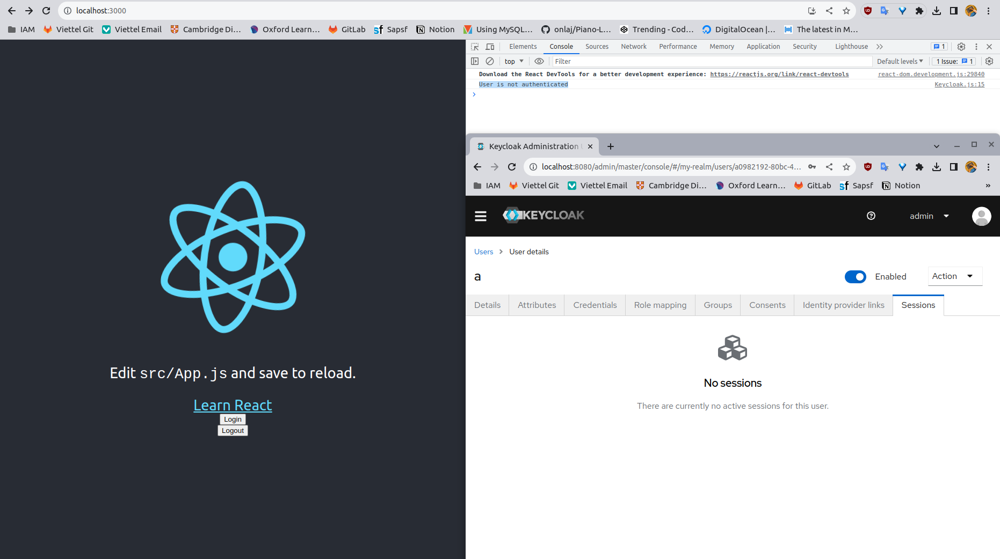
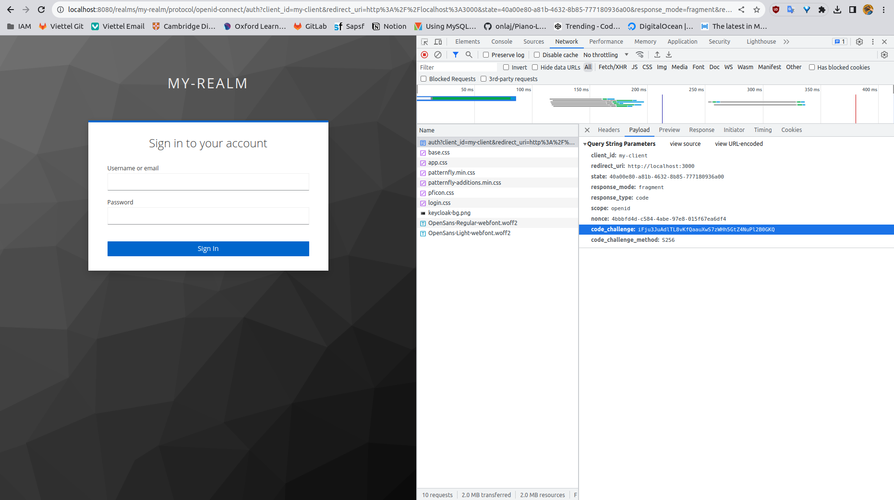
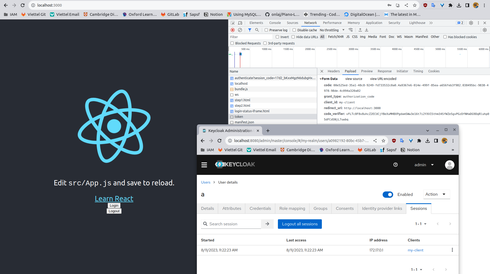
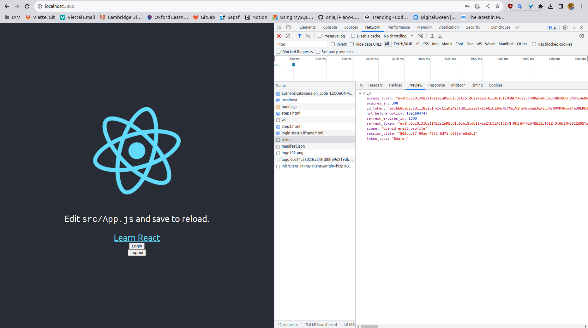
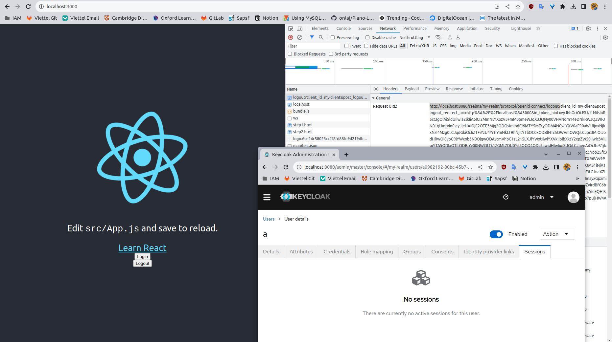

# Single-page application secured by Keycloak

## 1. Cấu hình Keycloak
- [Docker-compose](./docker-compose.yaml):
  ```docker
  version: '3'

  services:
    identity-broker:
      image: quay.io/keycloak/keycloak:22.0.1
      container_name: identity-broker
      network_mode: 'host'
      # ports:
      #   - '8080:8080'
      command: ["-v start-dev", "--import-realm"]
      volumes:
        - ./keycloak-configs/identity-broker:/opt/keycloak/data/import
      environment:
        KEYCLOAK_ADMIN: admin
        KEYCLOAK_ADMIN_PASSWORD: admin
    
    identity-provider:
      image: quay.io/keycloak/keycloak:22.0.1
      container_name: identity-provider
      network_mode: 'host'
      # ports:
      #   - '9090:9090'
      command: ["-v start-dev", "--import-realm", "--http-port=9090"]
      volumes:
        - ./keycloak-configs/identity-provider:/opt/keycloak/data/import
      environment:
        KEYCLOAK_ADMIN: admin
        KEYCLOAK_ADMIN_PASSWORD: admin
    
    web-ui:
      image: nginx:alpine
      container_name: web-ui
      network_mode: 'host'
      # ports:
      #   - '80:80'
      volumes:
        - ./build:/usr/share/nginx/html
    ```
- Keycloak configuration files: [keycloak-configs](./keycloak-configs)

## 2. Authorization Code Flow & Authorization Code Flow `with` Proof Key for Code Exchange (PKCE)
### 2.1. Authorization Code Flow `without` Proof Key for Code Exchange (PKCE)
**Authorization Code Flow** được sử dụng trong các Regular WebApp (ứng dụng web chạy trên server)


### 2.2. Authorization Code Flow `with` Proof Key for Code Exchange (PKCE)
**PKCE-enhanced Authorization Code Flow** được xây dựng trên **Authorization Code Flow** phục vụ mục đích trao đổi Auth Code lấy Access Token an toàn hơn trên các ứng dụng Single-page Application (React, Vue, Angular, etc)


Trong luồng của PKCE có thêm một bước là sinh ra cặp **(code_verifier, code_challenge)**:
  - code_verifier: một string sinh ngẫu nhiên
  - code_challenge = S256(code_verifier)

## 3. Single-page react application (2 ca sử dụng Login & Logout)
- Hướng dẫn chạy ứng dụng:
  ```bash
  $docker compose up -d
  ```
  *(Lưu ý React cần phải chạy trên cổng 3000)*

- Hình ảnh demo:
  - B1. Chưa có session nào được đăng nhập
    
  <!-- Chưa có session nào được đăng nhập. -->
  - B2. Gửi yêu cầu đăng nhập kèm **code_challenge**
    
  - B3. Đăng nhập thành công, xuất hiện session trên Keycloak và lấy được access token.
    
    
  - B4. Đăng xuất thành công
    

## 4. Tích hợp Identity Provider bên ngoài vào Keycloak